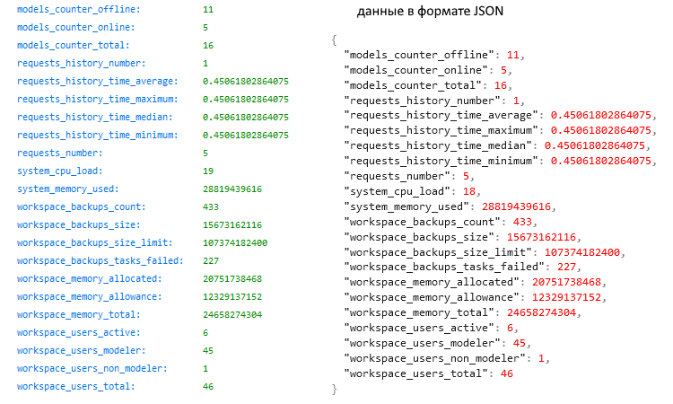
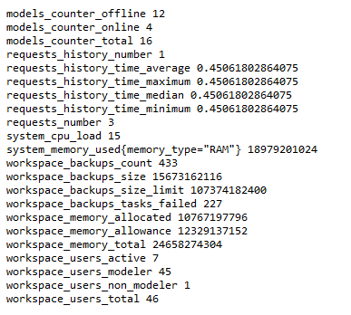

#  Документация по сервису метрик Optimacros

ИС Optimacros предоставляет доступ к сервису метрик основных параметров приложения по протоколу HTTP (для использования в системах Prometheus, Zabbix и т.п.).

Сервис метрик доступен по следующим точкам доступа:
- **/api/v1/metrics** (предоставляет метрики в формате [**JSON**](#metrics-json))
- **/api/v1/metrics/prometheus** (предоставляет метрики в формате [**Prometheus**](#metrics-prometheus))

Основные метрики приложения:
- системные (system)
  - [**system_cpu_load**](#metrics_system_cpu_load) - степень загруженности процессора в процентах от 0 до 100
  - [**system_memory_used**](#metrics_system_memory_used) - размер использованной памяти
- ворскспейс (workspace)
  - [**workspace_memory_allocated**](#metrics_workspace_memory_allocated) - размер занятой памяти
  - [**workspace_memory_allowance**](#metrics_workspace_memory_allowance) - максимальный размер занятой памяти
  - [**workspace_memory_total**](#metrics_workspace_memory_total) - размер общедоступной памяти
  - [**workspace_users_total**](#metrics_workspace_users_total) - количество всех пользователей
  - [**workspace_users_active**](#metrics_workspace_users_active) - количество залогиненных и активных пользователей
  - [**workspace_users_modeler**](#metrics_workspace_users_modeler) - количество пользователей-моделеров
  - [**workspace_users_non_modeler**](#metrics_workspace_users_non_modeler) - количество обычных пользователей
  - [**workspace_backups_count**](#metrics_workspace_backups_count) - количество созданных бэкапов
  - [**workspace_backups_size**](#metrics_workspace_backups_size) - размер созданных бэкапов
  - [**workspace_backups_size_limit**](#metrics_workspace_backups_size_limit) - лимит пространства для бэкапов
  - [**workspace_backups_tasks_failed**](#metrics_workspace_backups_tasks_failed) - количество провальных задач бэкапирования в системе
- модели (models)
  - [**models_counter_total**](#metrics_models_counter_total) - общее количество моделей в системе
  - [**models_counter_online**](#metrics_models_counter_online) - количество доступных моделей (online)
  - [**models_counter_offline**](#metrics_models_counter_offline) - количество недоступных моделей (offline)
- запросы (requests)
  - [**requests_number**](#metrics_requests_number) - количество запросов (мгновенное значение (RPS))
  - [**requests_history_number**](#metrics_requests_history_number) - общее количество запросов (по истории)
  - [**requests_history_time_minimum**](#metrics_requests_history_time_minimum) - минимальное время выполнения запросов
  - [**requests_history_time_maximum**](#metrics_requests_history_time_maximum) - максимальное время выполнения запросов
  - [**requests_history_time_average**](#metrics_requests_history_time_average) - среднее время выполнения запросов
  - [**requests_history_time_median**](#metrics_requests_history_time_median) - медиана времени выполнения запросов

## Метрики в формате JSON 

Точка доступа **/api/v1/metrics** предоставляет метрики в формате <a href="https://habr.com/ru/articles/554274/#json_object">**JSON**</a>.
 Чтобы получить данные, нужно отправить GET запрос по данному адресу Воркспейса.

Пример метрик в формате JSON: 

## Метрики в формате Prometheus 

Точка доступа **/api/v1/metrics/prometheus** предоставляет метрики в формате <a href="https://prometheus.io/docs/instrumenting/exposition_formats/">**Prometheus**</a>.
 Чтобы получить данные, нужно отправить GET запрос по данному адресу Воркспейса.

Пример метрик в формате Prometheus: 

## Детали метрик

### Системные метрики

#### system_cpu_load 

Данная метрика предоставляет информацию о загруженности процессора (в процентах - от 0% до 100%) компьютера, на котором работает воркспейс.
 Метрика представлена целым числом от 0 (минимальное значение) до 100 (максимальное значение).

#### system_memory_used 

Данная метрика предоставляет информацию об использованной оперативной памяти компьютера, на котором работает воркспейс.
 Метрика представлена целым числом и показывает размер использованной памяти в байтах.

### Метрики воркспейса

#### workspace_memory_allocated 

Данная метрика предоставляет информацию об использованной оперативной памяти на компьютере, где работает воркспейс. Т.е. отображает размер оперативной памяти, занимаемый всеми моделями, хранящимися на воркспейсе.
 Метрика представлена целым числом и показывает размер использованной памяти в байтах.
 Данная картинка показывает пример использованной оперативной памяти и связанные метрики:
 

#### workspace_memory_allowance 

Данная метрика предоставляет информацию об лимите оперативной памяти на компьютере, где работает воркспейс.
 Метрика представлена целым числом и показывает размер памяти в байтах.
 Приближение использованной оперативной памяти к данному лимиту указывает на увеличение размера воркспейса, возможно следует задуматься об удалении некоторых моделей или об увеличении размера оперативной памяти на компьютере.

#### workspace_memory_total 

Данная метрика предоставляет информацию о размере общей доступной оперативной памяти на компьютере, где работает воркспейс.
 Метрика представлена целым числом и показывает размер памяти в байтах.
 Использованная оперативная память физически не может быть больше доступной оперативной памяти.

#### workspace_users_total 

Данная метрика предоставляет информацию об общем количестве пользователей, имеющих доступ к воркспейсу.
 Метрика представлена целым числом.

#### workspace_users_active 

Данная метрика предоставляет информацию о количестве пользователей, которые залогинены в системе и активны в воркспейс в данный момент времени.
 Метрика представлена целым числом.

#### workspace_users_modeler 

Данная метрика предоставляет информацию об общем количестве **пользователей-моделеров**, имеющих доступ к воркспейсу.
 Метрика представлена целым числом.

#### workspace_users_non_modeler 

Данная метрика предоставляет информацию об общем количестве **обычных** пользователей (не моделеров), имеющих доступ к воркспейсу.
 Метрика представлена целым числом.

#### workspace_backups_count 

Данная метрика предоставляет информацию об общем количестве созданных бэкапов моделей.
 Метрика представлена целым числом.

#### workspace_backups_size 

Данная метрика предоставляет информацию о размере дисковой памяти на компьютере, которую занимают все созданные бэкапы моделей.
 Метрика представлена целым числом и показывает размер памяти в байтах.

#### workspace_backups_size_limit 

Данная метрика предоставляет информацию о лимите дисковой памяти на компьютере, которую занимают все созданные бэкапы моделей. 
 Метрика представлена целым числом и показывает размер памяти в байтах.
 Приближение использованной дисковой памяти, занятой созданными бэкапами моделей, к данному лимиту указывает на возможные проблемы с созданием бэкапов моделей, возможно следует задуматься об удалении бэкапов моделей или об увеличении дискового пространства на компьютере.

#### workspace_backups_tasks_failed 

Данная метрика предоставляет информацию об общем количестве провальных задач создания бэкапов моделей в системе.
 Метрика представлена целым числом.

### Метрики моделей

#### models_counter_total 

Данная метрика предоставляет информацию об общем количестве моделей, созданных в воркспейсе.
 Метрика представлена целым числом.

#### models_counter_online 

Данная метрика предоставляет информацию о количестве моделей в статусе **online** (доступны для работы).
 Метрика представлена целым числом.

#### models_counter_offline 

Данная метрика предоставляет информацию о количестве моделей в статусе **offline** (недоступны для работы).
 Метрика представлена целым числом.

### Метрики запросов

#### requests_number 

Данная метрика предоставляет информацию о количестве клиентских запросов, зарегистрированных в данный момент времени в воркспейсе.
 Метрика представлена целым числом.

#### requests_history_number 

Данная метрика предоставляет информацию о количестве клиентских запросов, исполнявшихся в воркспейсе в течении последних 5 минут.
 Метрика представлена целым числом.

#### requests_history_time_minimum 

Данная метрика предоставляет информацию о **минимальном** времени выполнения клиентских запросов, исполнявшихся в воркспейсе в течении последних 5 минут.
 Метрика представлена числом с плавающей точкой.

#### requests_history_time_maximum 

Данная метрика предоставляет информацию о **максимальном** времени выполнения клиентских запросов, исполнявшихся в воркспейсе в течении последних 5 минут.
 Метрика представлена числом с плавающей точкой.

#### requests_history_time_average 

Данная метрика предоставляет информацию о **среднем** времени выполнения клиентских запросов, исполнявшихся в воркспейсе в течении последних 5 минут.
 Метрика представлена числом с плавающей точкой.
 Среднее время является адекватной мерой только в случае нормального распределения выборки, поскольку оно слишком чувствительно к «выбросам» – слишком большим или слишком малым значениям, которые сильно выбиваются из общей тенденции.

#### requests_history_time_median 

Данная метрика предоставляет информацию о **медиане** времени выполнения клиентских запросов, исполнявшихся в воркспейсе в течении последних 5 минут.
 Метрика представлена числом с плавающей точкой.
 Медиана является серединой всей выборки времён ответов (см. <a href="https://habr.com/ru/companies/yoomoney/articles/433436/">Введение в исследование производительности</a>). В идеальной ситуации медиана и среднее равны. Если среднее сильно отличается от медианы, значит некоторые запросы выполнялись слишком медленно или слишком быстро, т.е. отклонялись от среднего значения. 

## Глоссарий

**JSON** — текстовый формат обмена данными, <a href="https://habr.com/ru/articles/554274/#json_object">основанный</a> на JavaScript.

**Ворскспейс (workspace)** – приложение (ПО «Оптимакрос»), на котором пользователи размещают свои модели и проводят работу с данными.

**Модель** – совокупность структур данных, связанных между собой, в виде мастер-данных, форм ввода, отчетов и визуализации, ограниченных конкретной областью (физической и логической (предметной)).

**Статус модели** – модель может быть в статусе online (доступна для работы) или offline (недоступна для работы).

**Моделер** - продвинутый пользователь ПО «Оптимакрос», который имеет доступ к инструментам и механизмам бизнес-моделированию ПО «Оптимакрос».

**Запрос (request)** – процесс обращения пользователя через систему ПО «Оптимакрос» к определенному функционалу системы.

**Бэкап (backup)** – резервная копия модели.

**Prometheus** - это система мониторинга и оповещений, хранящая и обрабатывающая метрики, собираемые из экспортеров в Time Series Database (TSDB). Prometheus сам собирает метрики, опрашивая необходимые сайты, предоставляющие метрики.

**Zabbix** - это программное обеспечение для мониторинга многочисленных параметров сети, жизнеспособности и целостности серверов, приложений, сервисов. Zabbix использует гибкий механизм оповещений, что позволяет пользователям настраивать уведомления основанные на e-mail практически на любое событие.

