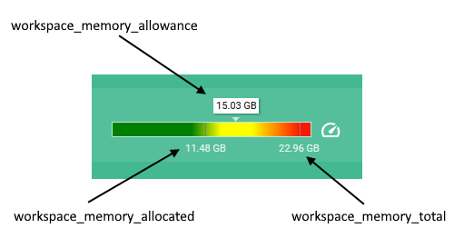

# Документация по сервису метрик Optimacros

ИС Optimacros предоставляет доступ к сервису метрик основных параметров приложения по протоколу HTTP (для использования в системах Prometheus, Zabbix и т.п.).

Сервис метрик доступен по следующим точкам доступа:

- **/api/v1/metrics** (предоставляет метрики в формате [**JSON**](#метрики-в-формате-json))
- **/api/v1/metrics/prometheus** (предоставляет метрики в формате [**Prometheus**](#метрики-в-формате-prometheus))

Основные метрики приложения:

- системные (system)
  - [**system_cpu_load**](#system_cpu_load) - степень загруженности процессора в процентах от 0 до 100
  - [**system_memory_used**](#system_memory_used) - размер использованной памяти
- воркспейс (workspace)
  - [**workspace_memory_allocated**](#workspace_memory_allocated) - размер занятой памяти
  - [**workspace_memory_allowance**](#workspace_memory_allowance) - максимальный размер занятой памяти
  - [**workspace_memory_total**](#workspace_memory_total) - размер общедоступной памяти
  - [**workspace_users_total**](#workspace_users_total) - количество всех пользователей
  - [**workspace_users_active**](#workspace_users_active) - количество аутентифицированных и активных пользователей
  - [**workspace_users_modeler**](#workspace_users_modeler) - количество пользователей-моделеров
  - [**workspace_users_non_modeler**](#workspace_users_non_modeler) - количество обычных пользователей
  - [**workspace_backups_count**](#workspace_backups_count) - количество созданных бэкапов
  - [**workspace_backups_size**](#workspace_backups_size) - размер созданных бэкапов
  - [**workspace_backups_size_limit**](#workspace_backups_size_limit) - лимит пространства для бэкапов
  - [**workspace_backups_tasks_failed**](#workspace_backups_tasks_failed) - количество провальных задач бэкапирования в системе
- все модели (models)
  - [**models_counter_online**](#models_counter_online) - количество доступных моделей (online)
  - [**models_counter_offline**](#models_counter_offline) - количество недоступных моделей (offline)
- одиночные модели(model)
  - [**model_uid_id**](#model_uid_id) - id модели
  - [**model_uid_name**](#model_uid_name) - имя модели
  - [**model_uid_status**](#model_uid_status) - статус модели
  - [**model_uid_memory**](#model_uid_memory) - размер оперативной памяти, занимаемый моделью
  - [**model_uid_serial_global**](#model_uid_serial_global) - глобальный серийный номер модели
  - [**model_uid_serial_meta**](#model_uid_serial_meta) - мета серийный номер модели
- запросы (requests)
  - [**requests_number**](#requests_number) - количество запросов (мгновенное значение (RPS))
  - [**requests_history_number**](#requests_history_number) - общее количество запросов (по истории)
  - [**requests_history_time_minimum**](#requests_history_time_minimum) - минимальное время выполнения запросов
  - [**requests_history_time_maximum**](#requests_history_time_maximum) - максимальное время выполнения запросов
  - [**requests_history_time_average**](#requests_history_time_average) - среднее время выполнения запросов
  - [**requests_history_time_median**](#requests_history_time_median) - медиана времени выполнения запросов

## Метрики в формате JSON

Точка доступа **/api/v1/metrics** предоставляет метрики в формате [**JSON**](https://habr.com/ru/articles/554274/#json_object).  
Чтобы получить данные, нужно отправить GET запрос по данному адресу Воркспейса.

Пример метрик в формате JSON:  

```plaintext
{
"model_26dcabf5dd07007371ce2a649024d03d_id": 276,
"model_26dcabf5dd07007371ce2a649024d03d_memory": 0,
"model_26dcabf5dd07007371ce2a649024d03d_name": "subset_filter",
"model_26dcabf5dd07007371ce2a649024d03d_serial_global": 0,
"model_26dcabf5dd07007371ce2a649024d03d_serial_meta": 0,
"model_26dcabf5dd07007371ce2a649024d03d_status": 1,
"models_counter_offline": 0,
"models_counter_online": 4,
"models_counter_total": 4,
"requests_history_number": 0,
"requests_history_time_average": 0,
"requests_history_time_maximum": 0,
"requests_history_time_median": 0,
"requests_history_time_minimum": 0,
"requests_number": 1,
"system_cpu_load": 10,
"system_memory_used": 12647743488,
"workspace_backups_count": 35,
"workspace_backups_size": 41011048,
"workspace_backups_size_limit": 107374182400,
"workspace_backups_tasks_failed": 0,
"workspace_memory_allocated": 0,
"workspace_memory_allowance": 1610612736,
"workspace_memory_total": 3221225472,
"workspace_users_active": 75,
"workspace_users_modeler": 2,
"workspace_users_non_modeler": 3,
"workspace_users_total": 5
}
```

## Метрики в формате Prometheus

Точка доступа **/api/v1/metrics/prometheus** предоставляет метрики в формате [**Prometheus**](https://prometheus.io/docs/instrumenting/exposition_formats/).
Чтобы получить данные, нужно отправить GET запрос по данному адресу Воркспейса.

Пример метрик в формате Prometheus:  

```plaintxt
model_26dcabf5dd07007371ce2a649024d03d_id{model_uid="26dcabf5dd07007371ce2a649024d03d",model_uid_26dcabf5dd07007371ce2a649024d03d="uid"} 276
model_26dcabf5dd07007371ce2a649024d03d_memory{model_uid="26dcabf5dd07007371ce2a649024d03d",model_uid_26dcabf5dd07007371ce2a649024d03d="uid"} 0
model_26dcabf5dd07007371ce2a649024d03d_serial_global{model_uid="26dcabf5dd07007371ce2a649024d03d",model_uid_26dcabf5dd07007371ce2a649024d03d="uid"} 0
model_26dcabf5dd07007371ce2a649024d03d_serial_meta{model_uid="26dcabf5dd07007371ce2a649024d03d",model_uid_26dcabf5dd07007371ce2a649024d03d="uid"} 0
model_26dcabf5dd07007371ce2a649024d03d_status{model_uid="26dcabf5dd07007371ce2a649024d03d",model_uid_26dcabf5dd07007371ce2a649024d03d="uid"} 1
model_4a3e2db72121ee4695b26de485f9f18a_id{model_uid="4a3e2db72121ee4695b26de485f9f18a",model_uid_4a3e2db72121ee4695b26de485f9f18a="uid"} 239
model_4a3e2db72121ee4695b26de485f9f18a_memory{model_uid="4a3e2db72121ee4695b26de485f9f18a",model_uid_4a3e2db72121ee4695b26de485f9f18a="uid"} 0
model_4a3e2db72121ee4695b26de485f9f18a_serial_global{model_uid="4a3e2db72121ee4695b26de485f9f18a",model_uid_4a3e2db72121ee4695b26de485f9f18a="uid"} 13
model_4a3e2db72121ee4695b26de485f9f18a_serial_meta{model_uid="4a3e2db72121ee4695b26de485f9f18a",model_uid_4a3e2db72121ee4695b26de485f9f18a="uid"} 13
model_4a3e2db72121ee4695b26de485f9f18a_status{model_uid="4a3e2db72121ee4695b26de485f9f18a",model_uid_4a3e2db72121ee4695b26de485f9f18a="uid"} 1
model_64971e146afce6246cee6d6aa4dcfa77_id{model_uid="64971e146afce6246cee6d6aa4dcfa77",model_uid_64971e146afce6246cee6d6aa4dcfa77="uid"} 164
model_64971e146afce6246cee6d6aa4dcfa77_memory{model_uid="64971e146afce6246cee6d6aa4dcfa77",model_uid_64971e146afce6246cee6d6aa4dcfa77="uid"} 0
model_64971e146afce6246cee6d6aa4dcfa77_serial_global{model_uid="64971e146afce6246cee6d6aa4dcfa77",model_uid_64971e146afce6246cee6d6aa4dcfa77="uid"} 16
model_64971e146afce6246cee6d6aa4dcfa77_serial_meta{model_uid="64971e146afce6246cee6d6aa4dcfa77",model_uid_64971e146afce6246cee6d6aa4dcfa77="uid"} 16
model_64971e146afce6246cee6d6aa4dcfa77_status{model_uid="64971e146afce6246cee6d6aa4dcfa77",model_uid_64971e146afce6246cee6d6aa4dcfa77="uid"} 1
model_f6bc3e886aee01efcae65b81eb177cd6_id{model_uid="f6bc3e886aee01efcae65b81eb177cd6",model_uid_f6bc3e886aee01efcae65b81eb177cd6="uid"} 198
model_f6bc3e886aee01efcae65b81eb177cd6_memory{model_uid="f6bc3e886aee01efcae65b81eb177cd6",model_uid_f6bc3e886aee01efcae65b81eb177cd6="uid"} 0
model_f6bc3e886aee01efcae65b81eb177cd6_serial_global{model_uid="f6bc3e886aee01efcae65b81eb177cd6",model_uid_f6bc3e886aee01efcae65b81eb177cd6="uid"} 0
model_f6bc3e886aee01efcae65b81eb177cd6_serial_meta{model_uid="f6bc3e886aee01efcae65b81eb177cd6",model_uid_f6bc3e886aee01efcae65b81eb177cd6="uid"} 0
model_f6bc3e886aee01efcae65b81eb177cd6_status{model_uid="f6bc3e886aee01efcae65b81eb177cd6",model_uid_f6bc3e886aee01efcae65b81eb177cd6="uid"} 1
models_counter_offline 0
models_counter_online 4
models_counter_total 4
requests_history_number 0
requests_history_time_average 0
requests_history_time_maximum 0
requests_history_time_median 0
requests_history_time_minimum 0
requests_number 1
system_cpu_load 6
system_memory_used{memory_type="RAM"} 12821495808
workspace_backups_count 35
workspace_backups_size 41011048
workspace_backups_size_limit 107374182400
workspace_backups_tasks_failed 0
workspace_memory_allocated 0
workspace_memory_allowance 1610612736
workspace_memory_total 3221225472
workspace_users_active 75
workspace_users_modeler 2
workspace_users_non_modeler 3
workspace_users_total 5
```

## Детали метрик

### Системные метрики

#### system_cpu_load

Данная метрика предоставляет информацию о загруженности процессора (в процентах - от 0% до 100%) компьютера, на котором работает воркспейс.  
Метрика представлена целым числом от 0 (минимальное значение) до 100 (максимальное значение).

#### system_memory_used

Данная метрика предоставляет информацию об использованной оперативной памяти компьютера, на котором работает воркспейс.  
Метрика представлена целым числом и показывает размер использованной памяти в байтах.

### Метрики воркспейса

#### workspace_memory_allocated

Данная метрика предоставляет информацию об использованной оперативной памяти на компьютере, где работает воркспейс. Т.е. отображает размер оперативной памяти, занимаемый всеми моделями, хранящимися на воркспейсе.  
Метрика представлена целым числом и показывает размер использованной памяти в байтах.  
Данная картинка показывает пример использованной оперативной памяти и связанные метрики:  


#### workspace_memory_allowance

Данная метрика предоставляет информацию об лимите оперативной памяти на компьютере, где работает воркспейс.  
Метрика представлена целым числом и показывает размер памяти в байтах.  
Приближение использованной оперативной памяти к данному лимиту указывает на увеличение размера воркспейса, возможно следует задуматься об удалении некоторых моделей или об увеличении размера оперативной памяти на компьютере.

#### workspace_memory_total

Данная метрика предоставляет информацию о размере общей доступной оперативной памяти на компьютере, где работает воркспейс.  
Метрика представлена целым числом и показывает размер памяти в байтах.  
Использованная оперативная память физически не может быть больше доступной оперативной памяти.

#### workspace_users_total

Данная метрика предоставляет информацию об общем количестве пользователей, имеющих доступ к воркспейсу.  
Метрика представлена целым числом.

#### workspace_users_active

Данная метрика предоставляет информацию о количестве пользователей, которые аутентифицированы в системе и активны в воркспейсе в данный момент времени.  
Метрика представлена целым числом.

#### workspace_users_modeler

Данная метрика предоставляет информацию об общем количестве **пользователей-моделеров**, имеющих доступ к воркспейсу.  
Метрика представлена целым числом.

#### workspace_users_non_modeler

Данная метрика предоставляет информацию об общем количестве **обычных** пользователей (не моделеров), имеющих доступ к воркспейсу.  
Метрика представлена целым числом.

#### workspace_backups_count

Данная метрика предоставляет информацию об общем количестве созданных бэкапов моделей.  
Метрика представлена целым числом.

#### workspace_backups_size

Данная метрика предоставляет информацию о размере дисковой памяти на компьютере, которую занимают все созданные бэкапы моделей.  
Метрика представлена целым числом и показывает размер памяти в байтах.

#### workspace_backups_size_limit

Данная метрика предоставляет информацию о лимите дисковой памяти на компьютере, которую занимают все созданные бэкапы моделей.  
Метрика представлена целым числом и показывает размер памяти в байтах.  
Приближение использованной дисковой памяти, занятой созданными бэкапами моделей, к данному лимиту указывает на возможные проблемы с созданием бэкапов моделей, возможно следует задуматься об удалении бэкапов моделей или об увеличении дискового пространства на компьютере.

#### workspace_backups_tasks_failed

Данная метрика предоставляет информацию об общем количестве провальных задач создания бэкапов моделей в системе.  
Метрика представлена целым числом.

### Метрики моделей

#### models_counter_total

Данная метрика предоставляет информацию об общем количестве моделей, созданных в воркспейсе.  
Метрика представлена целым числом.

#### models_counter_online

Данная метрика предоставляет информацию о количестве моделей в статусе **online** (доступны для работы).  
Метрика представлена целым числом.

#### models_counter_offline

Данная метрика предоставляет информацию о количестве моделей в статусе **offline** (недоступны для работы).  
Метрика представлена целым числом.

### Метрики модели

{uid} - это uid вашей модели. Окончательные метрики будут выглядеть по этому примеру - model_b2afe10885611e2c6ece570f82ebf85a_id

#### model_{uid}_id

Данная метрика предоставляет информацию о численном значении id модели по его uid.

#### model_{uid}_name

Данная метрика предоставляет информацию о имени модели по его uid. Данная метрика присутствует в формате JSON и отсутствует в формате Prometheus.

#### model_{uid}_status

Данная метрика предоставляет информацию о статусе модели по его uid. При 1 - модель в сети, при 0 - модель не в сети.

#### model_{uid}_memory

Данная метрика предоставляет информацию о занятой памяти модели по его uid.

#### model_{uid}_serial_global

Данная метрика предоставляет информацию о глобальном серийном номере модели по его uid.

#### model_{uid}_serial_meta

Данная метрика предоставляет информацию о мета серийном номере модели по его uid.

### Метрики запросов

#### requests_number

Данная метрика предоставляет информацию о количестве клиентских запросов, зарегистрированных в данный момент времени в воркспейсе.  
Метрика представлена целым числом.

#### requests_history_number

Данная метрика предоставляет информацию о количестве клиентских запросов, исполнявшихся в воркспейсе в течении последних 5 минут.  
Метрика представлена целым числом.

#### requests_history_time_minimum

Данная метрика предоставляет информацию о **минимальном** времени выполнения клиентских запросов, исполнявшихся в воркспейсе в течении последних 5 минут.  
Метрика представлена числом с плавающей точкой.

#### requests_history_time_maximum

Данная метрика предоставляет информацию о **максимальном** времени выполнения клиентских запросов, исполнявшихся в воркспейсе в течении последних 5 минут.  
Метрика представлена числом с плавающей точкой.

#### requests_history_time_average

Данная метрика предоставляет информацию о **среднем** времени выполнения клиентских запросов, исполнявшихся в воркспейсе в течении последних 5 минут.  
Метрика представлена числом с плавающей точкой.  
Среднее время является адекватной мерой только в случае нормального распределения выборки, поскольку оно слишком чувствительно к «выбросам» – слишком большим или слишком малым значениям, которые сильно выбиваются из общей тенденции.

#### requests_history_time_median

Данная метрика предоставляет информацию о **медиане** времени выполнения клиентских запросов, исполнявшихся в воркспейсе в течении последних 5 минут.  
Метрика представлена числом с плавающей точкой.  
Медиана является серединой всей выборки времён ответов (см. [Введение в исследование производительности](https://habr.com/ru/companies/yoomoney/articles/433436/)). В идеальной ситуации медиана и среднее равны. Если среднее сильно отличается от медианы, значит некоторые запросы выполнялись слишком медленно или слишком быстро, т.е. отклонялись от среднего значения.

## Методы фильтрации и группировок

### Группировка по UID модели

Группировка осуществляется только в формате JSON путем добавления параметра groupByTags по такому шаблону:

`api/v1/metrics?groupByTags=model_uid_{uid}`, где {uid} - это uid модели

Пример запроса - `api/v1/metrics?groupByTags=model_uid_1ea0eafdf2b16b1c339b4575933cfc8d`

Пример метрик в формате JSON:  

```plaintext
{
  "model_26dcabf5dd07007371ce2a649024d03d_id": 276,
  "model_26dcabf5dd07007371ce2a649024d03d_memory": 0,
  "model_26dcabf5dd07007371ce2a649024d03d_name": "subset_filter",
  "model_26dcabf5dd07007371ce2a649024d03d_serial_global": 0,
  "model_26dcabf5dd07007371ce2a649024d03d_serial_meta": 0,
  "model_26dcabf5dd07007371ce2a649024d03d_status": 1
}
{
  "other_metrics": "some values"
}

```

### Группировка по моделям

Группировка осуществляется только в формате JSON по запросу `api/v1/metrics?groupByTags=model_uid`

Пример метрик в формате JSON:  

```plaintext
{
  "model_26dcabf5dd07007371ce2a649024d03d_id": 276,
  "model_26dcabf5dd07007371ce2a649024d03d_memory": 0,
  "model_26dcabf5dd07007371ce2a649024d03d_name": "subset_filter",
  "model_26dcabf5dd07007371ce2a649024d03d_serial_global": 0,
  "model_26dcabf5dd07007371ce2a649024d03d_serial_meta": 0,
  "model_26dcabf5dd07007371ce2a649024d03d_status": 1
},
{
  "model_4a3e2db72121ee4695b26de485f9f18a_id": 239,
  "model_4a3e2db72121ee4695b26de485f9f18a_memory": 0,
  "model_4a3e2db72121ee4695b26de485f9f18a_name": "subset_filter_3",
  "model_4a3e2db72121ee4695b26de485f9f18a_serial_global": 13,
  "model_4a3e2db72121ee4695b26de485f9f18a_serial_meta": 13,
  "model_4a3e2db72121ee4695b26de485f9f18a_status": 1
},
{
  "other_metrics": "some values"
}

```

### Фильтрация по uid модели

Фильтрация осуществляется путем добавления параметра model_uid. Она исключает все метрики и оставляет только метрики определенной модели. Примеры:

`api/v1/metrics?model_uid=26dcabf5dd07007371ce2a649024d03d`

`api/v1/metrics/prometheus?model_uid=26dcabf5dd07007371ce2a649024d03d`

```plaintext
{
  "model_26dcabf5dd07007371ce2a649024d03d_id": 276,
  "model_26dcabf5dd07007371ce2a649024d03d_memory": 0,
  "model_26dcabf5dd07007371ce2a649024d03d_name": "subset_filter",
  "model_26dcabf5dd07007371ce2a649024d03d_serial_global": 0,
  "model_26dcabf5dd07007371ce2a649024d03d_serial_meta": 0,
  "model_26dcabf5dd07007371ce2a649024d03d_status": 1
},
```

## Глоссарий

**JSON** — текстовый формат обмена данными, [основанный](https://habr.com/ru/articles/554274/#json_object) на JavaScript.

**Воркспейс (workspace)** – приложение (ПО «Оптимакрос»), на котором пользователи размещают свои модели и проводят работу с данными.

**Модель** – совокупность структур данных, связанных между собой, в виде мастер-данных, форм ввода, отчетов и визуализации, ограниченных конкретной областью (физической и логической (предметной)).

**Статус модели** – модель может быть в статусе online (доступна для работы) или offline (недоступна для работы).

**Моделер** - продвинутый пользователь ПО «Оптимакрос», который имеет доступ к инструментам и механизмам бизнес-моделированию ПО «Оптимакрос».

**Запрос (request)** – процесс обращения пользователя через систему ПО «Оптимакрос» к определенному функционалу системы.

**Бэкап (backup)** – резервная копия модели.

**Prometheus** - это система мониторинга и оповещений, хранящая и обрабатывающая метрики, собираемые из экспортеров в Time Series Database (TSDB). Prometheus сам собирает метрики, опрашивая необходимые сайты, предоставляющие метрики.

**Zabbix** - это программное обеспечение для мониторинга многочисленных параметров сети, жизнеспособности и целостности серверов, приложений, сервисов. Zabbix использует гибкий механизм оповещений, что позволяет пользователям настраивать уведомления основанные на e-mail практически на любое событие.
